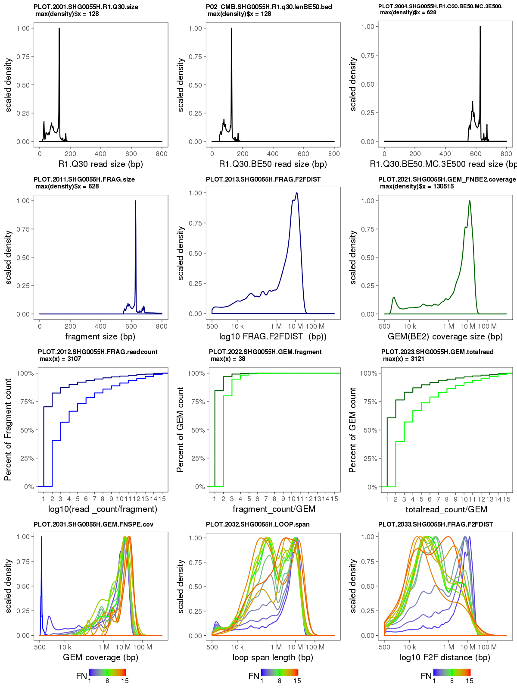

<h5>

```diff
- "Currently, ChIA-DropBox is under review, 
- and will be opened to public after we published our paper.
- For the test purpose, 
- users should download the code directly from the browser after logging in using provided ID and password. 
- "git clone or wget" will work when we open ChIA-DropBox to public." 
- We have added scripts for GEO SRRxxx fastq file.
```

</h5>


## ChIA-DropBox
*---- a novel analysis and visualization pipeline for multiplex chromatin interactions*

<font size="1" color="black" face="verdana">*Simon Zhongyuan Tian, Daniel Capurso, Minji Kim, Byoungkoo Lee, Meizhen Zheng, Yijun Ruan*</font>

Recently, we developed **ChIA-Drop**<span style="color:blue"><sup>1</sup></span>, a novel experimental method for detecting multiplex chromatin interactions with single-molecule precision via droplet-based and barcode-linked sequencing. **ChIA-DropBox**  a novel toolkit for analyzing and visualizing multiplex chromatin interactions, which includes:  a **ChIA-DropBox data processing pipeline**<span style="color:blue"><sup>2</sup></span> and a visualizing tool **ChIA-View**<span style="color:blue"><sup>3</sup></span>.

<span style="color:blue"><sup>1</sup></span>  [Meizhen Zheng, Simon Zhongyuan Tian, Daniel Capurso, Minji Kim, Rahul Maurya, Byoungkoo Lee, Emaly Piecuch et al. "Multiplex chromatin interactions with single-molecule precision."  Nature 566, 558 (2019).](https://www.nature.com/articles/s41586-019-0949-1) & [GSE109355](https://www.ncbi.nlm.nih.gov/geo/query/acc.cgi?acc=GSE109355) 

<span style="color:blue"><sup>2</sup></span> *https://github.com/TheJacksonLaboratory/ChIA-DropBox.git*

<span style="color:blue"><sup>3</sup></span> *https://github.com/TheJacksonLaboratory/ChIA-view.git*


<font size="3" color="blue" face="verdana"> This pipeline was developed and executed in Centos 6.5 of HPC (high performance computing). </font>
## 0 Data source

 

## 1 Prepare materials for longranger

### 1.1 Install longranger pipeline
Download 10X Genomeics <b><i>[longranger pipeline](https://support.10xgenomics.com/genome-exome/software/downloads/latest)</i></b>, and then install it according to its [Instruction](https://support.10xgenomics.com/genome-exome/software/pipelines/latest/installation). We have tested **longranger v1.x**, which could be download from: https://support.10xgenomics.com/genome-exome/software/downloads/1.x/


### 1.2 Prepare reference genome 
Before running ChIA-dropbox pipeline, we need to prepare genome reference according to [10X Genomics guide](https://support.10xgenomics.com/genome-exome/software/pipelines/latest/advanced/references). Current ChIA-DropBox can be used for these version genomes: **dm3**, **dm6**, **hg19**, **hg38**, **mm9**, **mm10**.

```shell
mkdir reference_genome/
cd reference_genome/
ls 
refdata-dm3/
refdata-hg19-2.1.0/
refdata-GRCh38-2.1.0/
...
```


### 1.3 Prepare FASTQ files

For users, we suggest 3 data soures. **Testing data**: (Miseq) are some small size data for pipeline testing. **ChIA-Drop Production data**: are data releaseb by our Natuure paper.  **User Data**: are data generageted by user-self.


#### 1.3.1 Testing data (Miseq)

RNAP2 ChIA-Drop: SHG0051 & ChIA-Drop: SHG0061 & Pure-DNA ChIA-Drop: SHG0041


are aviable @ *https://www.dropbox.com/sh/klb1hwprl66qced/AAAGEE9e5SumVEK31jCN4NTKa?dl=0*

#### 1.3.2 GSE109355 Production data (Nextseq/Hiseq) 

Please rename the SRRxxx FASTQs to following psydo-name, which format is required by longranger pipeline: 

RNAP2 ChIA-Drop: SHG0051H @ [SRR7722067](https://trace.ncbi.nlm.nih.gov/Traces/sra/?run=SRR7722067)
```
MCP.FASTQ/
mv SRR7722067.1.fastq SHG0051H_GT18-08809_SI-GA-B5_S20_L004_R1_001.fastq.gz
mv SRR7722067.2.fastq SHG0051H_GT18-08809_SI-GA-B5_S20_L004_R2_001.fastq.gz
```
ChIA-Drop: SHG0061H @ [SRR7722059](https://trace.ncbi.nlm.nih.gov/Traces/sra/?run=SRR7722059)

```
cd MCP.FASTQ/
mv SRR7722059.1.fastq SHG0061H_GT18-08817_SI-GA-B10_S28_L006_R1_001.fastq.gz
mv SRR7722059.1.fastq SHG0061H_GT18-08817_SI-GA-B10_S28_L006_R2_001.fastq.gz
```
#### 1.3.3 User Self generate fastqs

If user want to generate fastq files by yourself, please use <b><i>[longranger mkfastq](https://support.10xgenomics.com/genome-exome/software/pipelines/latest/using/mkfastq)</i></b>. 


```{bash}
MCP.FASTQ/SHG0055H_GT18-19704_SI-GA-H11_S22_L001_R1_001.fastq.gz
MCP.FASTQ/SHG0055H_GT18-19704_SI-GA-H11_S22_L001_R2_001.fastq.gz
```

### 1.4 Loading modules in HPC and Install dependent packages.

Following tools and packages are necessary for ChIA-DropBox data processing pipeline.
```{bash}
module load longranger/2.1.5 (or later version);
module load python/2.7.13 (packages: os, sys, subprocess, operator, collections,time, pysam, pybedtools, glob)
module load samtools/1.8;
module load java/1.8.0
module load R/3.4.4 (packages: dplyr, ggplot2, gridExtra, scales, sitools)
module load BEDtools/2.26.0
module load ImageMagick/7.0.7-26
module load juicer/1.7.5

# make allies for juicer:
juicer1="/opt/compsci/juicer/1.7.5/CPU/common/"
juicer2="/opt/compsci/juicer/1.7.5/"
```

## 2 Run Pipeline

### 2.1 Name the library

ChIA-dropbox pipeline automaticly processes data accoding to "library name". After you have prepared above praparation, please create a folder in you HPC system. The folder name should stricly following following strategry:

* If the library was sequenced by Illumina **Miseq**, the folder named with <b><i>3 letters + 4 digits</b></i> (e.g. SHG0024)

* If the library was sequenced by Illumina **Hiseq**, the folder named with <b><i>3 letters + 4 digits + "H"</b></i> (e.g. SHG0024H)

* If the library was sequenced by Illumina **Nextseq**, the folder named with <b><i>3 letters + 4 digits + "N"</b></i> (e.g. SHG0024N)

* If the library was sequenced by Illumina **NovaSeq**, the folder named with <b><i>3 letters + 4 digits + "V"</b></i> (e.g. SHG0024V) 

For example, regarding to the example fastq files above (<b>1.3</b>), we should create a folder named: SHG0055H 


### 2.2 Download ChIA-dropbox pipeline

Download ChIA-dropbox pipeline to you HPC system from github  to the library folder created in <b>2.1</b> (e.g. copy all files into SHG0055H/)

for example:
``` shell
git clone https://github.com/TheJacksonLaboratory/ChIA-DropBox.git
ls ChIA-dropbox-v1.0/
mkdir SHG0055H
cd SHG0055H/
cp -rf ../ChIA-dropbox-v1.0/MCP* .

```


### 2.3 Setup parameters

#### 2.3.1 Prepare Pipeline


```shell

## FASTQ
cd SHG0055H/MCP.FASTQ/

#!! please copy fastq file here : 
cp /path-to-fastq/SHG0055H_GT18-08809_SI-GA-B5_S20_L004_R1_001.fastq SHG0055H_GT18-08809_SI-GA-B5_S20_L004_R1_001.fastq
cp /path-to-fastq/SHG0055H_GT18-08809_SI-GA-B5_S20_L004_R1_001.fastq SHG0055H_GT18-08809_SI-GA-B5_S20_L004_R1_001.fastq

## or soft link:
ln -s /path-to-fastq/SHG0055H_GT18-08809_SI-GA-B5_S20_L004_R1_001.fastq SHG0055H_GT18-08809_SI-GA-B5_S20_L004_R1_001.fastq
ln -s /path-to-fastq/SHG0055H_GT18-08809_SI-GA-B5_S20_L004_R1_001.fastq SHG0055H_GT18-08809_SI-GA-B5_S20_L004_R1_001.fastq

## Reference genome
cd SHG0055H/
ln -s /projects/ruan-lab/Sequence_pool/10X/REFGNM10X/ MCP.REF
## detail see: 1.2 Prepare reference genome 

## Fastq type (input fasteq file type: from GEO SRR type or generate by lingrange mkfastq)
## This script will tansform the name of fastq, which is from SRR compressed.

cd SHG0055H/
sh MCP_RUN00_prepare_data.sh
#This data is download from GEO (SRR...) or NOT? (SRR/NOT):
SRR

ls MCP.FASTQ/*
MCP.FASTQ/SHG0055H_GT18-08809_SI-GA-B5_S20_L004_R1_001.fastq
MCP.FASTQ/SHG0055H_GT18-08809_SI-GA-B5_S20_L004_R1_001.fastq

```


#### 2.3.2 Run MCP_RUN01_initiate_parameters.sh

We integerate a script called <b>MCP_RUN01_initiate_parameters.sh</b>, via which we could setup all necessary parameters for this ChIA-dropbox pipeline. We only need to follow the questions and answer each of them acoording to its recommanded answer, see following example please.

```diff


$ cd /path-to-data-processing/SHG0055H/

$ sh MCP_RUN01_initiate_parameters.sh

################
Library name: SHG0055H
~~~~~~~~~~
SHG0055H
################
qsub ID: 1055
~~~~~~~~~~
1055
##################
1055
Longranger .mro LIB-ID (must be all digits): 1055
1055
~~~~~~~~~~
1055
##################
folder of fastq: /path-to-data-processing/SHG0055H/FASTQ/
/path-to-data-processing/SHG0055H/FASTQ/SHG0055H_GT18-19704_SI-GA-H11_S22_L001_R1_001.fastq.gz
/path-to-data-processing/SHG0055H/FASTQ/SHG0055H_GT18-19704_SI-GA-H11_S22_L001_R2_001.fastq.gz
~~~~~~~~~~
/path-to-data-processing/SHG0055H/FASTQ/
SHG0055H_GT18-19704_SI-GA-H11_S22_L001_I1_001.fastq.gz  SHG0055H_GT18-19704_SI-GA-H11_S22_L001_R1_001.fastq.gz  SHG0055H_GT18-19704_SI-GA-H11_S22_L001_R2_001.fastq.gz
###################
EXAMPLE:  SHG0066_GT18-06593_SI-GA-A1_S5_L001_I1_001.fastq.gz
fastq prefix: SHG0055H_GT18-19704_SI-GA-H11
/path-to-data-processing/SHG0055H/FASTQ/SHG0055H_GT18-19704_SI-GA-H11_S22_L001_R1_001.fastq.gz
/path-to-data-processing/SHG0055H/FASTQ/SHG0055H_GT18-19704_SI-GA-H11_S22_L001_R2_001.fastq.gz
~~~~~~~~~~
SHG0055H_GT18-19704_SI-GA-H11
###################
cpu number required: 16
~~~~~~~~~~
16
###################
memory size required: 150gb
~~~~~~~~~~
150gb
###################
pipeline running time requierd: 25
~~~~~~~~~~
25
###################
fragment extention size (0, 3000, 5000 ...): 3000
~~~~~~~~~~
3000
###################
execute mark: 20190116-142816
~~~~~~~~~~
20190116-142816
###################
cell gender (m=male; f=female) : m
~~~~~~~~~~
m
###################
genome reference (hg19, hg38, mm9, mm10, dm3, dm6, dm3hg19, hg19dm3) : dm3
genome size file: /path-to-data-processing/SHG0055H/MCP.pc//dm3_len_6CHROM.txt
~~~~~~~~~~
/path-to-data-processing/SHG0055H/MCP.pc//dm3_len_6CHROM.txt
###################
/path-to-data-processing/SHG0055H/REF/refdata-dm3
genome reference directory: /path-to-data-processing/SHG0055H/REF/refdata-dm3
~~~~~~~~~~
/path-to-data-processing/SHG0055H/REF/refdata-dm3
###################
```

After running <b>MCP_RUN01_initiate_parameters.sh</b>, there will occur two new configuration files for this library: <b>MCP.conf</b> and <b>MCP.mro</b>.

#### 2.3.3 Run MCP_RUN02_exec_pipeline_from_to.sh

<b>MCP_RUN02_exec_pipeline_from_to.sh</b> is the script to select pipeline steps and generate <b>qsub</b> file (HPC job file).


```diff


$sh MCP_RUN02_exec_pipeline_from_to.sh

CDB0 = STEP0000_MAPPING.run
CDB1 = STEP0001_MKDOO.run
CDB2 = STEP0101_GETBC.run
...
CDB37 = STEP2001_plot.sh
CDB38 = STEP2002_combine_image.run

from
0
TO
38
SHG0055H

B/S (B: big resource is needed; S: small resource is needed)
B

#! /bin/bash
#PBS -l nodes=1:ppn=16,mem=150gb,walltime=25:00:00
#PBS -N  SHG0055H.0.38.dm3
cd $PBS_O_WORKDIR
FROM=0
TO=38

OUTSIDE=`pwd`
source ${OUTSIDE}/MCP.conf
source ${OUTSIDE}/MCP.module
MCPPC.PART.0-38.qsub
qsub  MCPPC.PART.0-38.qsub
```

This script (MCP_RUN02_exec_pipeline_from_to.sh) will create a qsub file <b>MCPPC.PART.0-38.qsub</b>, which runs the pipeline from very beginning (CDB0 = STEP0000_MAPPING.run) to the end (CDB38 = STEP2002_combine_image.run). We can also manually select steps or step to execute (by select FROM and TO):

```diff


$sh MCP_RUN02_exec_pipeline_from_to.sh

CDB0 = STEP0000_MAPPING.run
CDB1 = STEP0001_MKDOO.run
...
CDB37 = STEP2001_plot.sh
CDB38 = STEP2002_combine_image.run

from
12
TO
23
SHG0055H

B/S (Big=this library defined qsub resource needed; Small=default qsub)
S 

#! /bin/bash
#PBS
#PBS -N  SHG0055H.12.23.dm3
cd $PBS_O_WORKDIR
FROM=12
TO=23

OUTSIDE=`pwd`
source ${OUTSIDE}/MCP.conf
source ${OUTSIDE}/MCP.module
MCPPC.PART.12-23.qsub
qsub  MCPPC.PART.12-23.qsub
```
### 2.4 Submit pipeline qsub

Using the command generated in 2.3.3, we can submit the job to the HPC:
```diff
$ qsub  MCPPC.PART.12-23.qsub

$ qstat -u stian

Job ID                  Username    Queue    Jobname          SessID  NDS   TSK   Memory      Time    S   Time
----------------------- ----------- -------- ---------------- ------ ----- ------ --------- --------- - ---------
9093578.helix-master    stian       batch    SHG0055H.12.23.dm   7638     1      1       --   01:00:00 R  00:00:02

$ qsub MCPPC.PART.0-38.qsub

Job ID                  Username    Queue    Jobname          SessID  NDS   TSK   Memory      Time    S   Time
----------------------- ----------- -------- ---------------- ------ ----- ------ --------- --------- - ---------
9093579.helix-master    stian       batch    SHG0055H.0.38.dm3    --      1     16     150gb  25:00:00 Q       --

```
Commonly, for a 10 M reads library, qsub executive time is ~ 5 hours. 
* <b>/path-to-data-processing/SHG0055H/SHG0055H.0-38.20190114-122447.log</b>: recorded all steps log.
* <b>/path-to-data-processing/SHG0055H/SHG0055H.0.38.dm3.o9090159</b>: reports qsub executive information.


### 2.5 ChIA-dropbox pipeline output 

#### <font color="blue"> D12_REPORT/</font>

ChIA-dropbox generates statistices informatin in <b>/path-to-data-processing/SHG0055H/SHG0055H/D12_REPORT/</b>.
```shell
$ cat /path-to-data-processing/SHG0055H/SHG0055H/D12_REPORT/SHG0017_sta.csv

SHG0055H	lib
0.010103762232363806	pcr_duplication
8142864	Total_PET_(Paired_end_reads)
2073187	PET_with_BC_(BarCode)
1704288	Uniq_Mappable_reads (R1)
267914	Reads_mapq>=30
97141	Reads_q>=30_&_len>=50bp
92071	Reads_q>=30_&_len>=50bp_&_3'ext500
92071	Reads_q>=30_&_len>=50bp_&_3'ext500_&_MAJOR_CHROM
304151	BC_count_of_PET-w/-BC_(BarCode)
291621	BC_of_Uniq_Mappable_reads_(R1)
43743	BC_of_Reads_q>=30_&_len>=50bp_&_3'ext500_&_MAJOR_CHROM
43743	GEM_TOTAL
41562	GEM_singleFrag
2181	GEM_multiFrags
296	GEM_of_intra_chrom
1885	GEM_of_inter_chrom
574	GEM_of_inter_chrom_divby_chrom_has_multiFrags
5751	GEM_of_inter_chrom_divby_chrom_has_singleFrag
48183	GEM_of_TOTAL_SA_[SingleFrag+IntraFrags]
47313	GEM_with_Frags=1
779	GEM_with_Frags=2
72	GEM_with_Frags=3
14	GEM_with_Frags=4
4	GEM_with_Frags=5
...
```
#### <font color="blue"> D05_TABLE/</font>
ChIA-dropbox prepared multiple formats of output files to meet different requirments.

##### (1) Per line per GEM

 *  <b><i>.PlinePgemSimp</i><b> --- Per line per GEM with fragments coodinates.

GEM_ID|GEM_coordinate|GEM_span|Fragment_number|List_of_fragment_coordinates(read count/fragment)
 ---|---|---|---|---
SHG0055H-10000046-AAACACCAGTAACGATBX1-FA-1-0|chrX:16274973-16286464|11491|2|chrX:16274973-16275587(0);chrX:16285880-16286464(1)
SHG0055H-10000116-AAACACCGTACAGAGCBX1-FA-1-0|chrX:10798609-18731966|7933357|2|chrX:10798609-10799202(0);chrX:18731338-18731966(1)


##### (2) Per line per fragment

* <b><i>.region(.rds)</i><b> --- in ChIA-view to see linear alignment and clustering view for multiple fragments. In this file, per line represents per fragment; fragments are of a same complex owning same GEM-ID. 

 |Chrom|Start|End|Frag_num/GEM|GEM_ID|
 |---|---|---|---|---|
 |chrX|16274973|16275587|2|SHG0055H-1000-10000046-AAACACCAGTAACGATBX1-M02838-FA-1-0|

* <b><i>.region.PEanno(.rds)</i><b> --- in ChIA-view to see linear alignment and clustering view for multiple fragments, with annoted fragments by promoter or num-promoter. 
  
 |Chrom|Start|End|Frag_num/GEM|GEM_ID|PEanno|
 |---|---|---|---|---|---|
 |chrX|16274973|16275587|2|SHG0055H-1000-10000046-AAACACCAGTAACGATBX1-M02838-FA-1-0|P|
 |chrX|16285880|16286464|2|SHG0055H-1000-10000046-AAACACCAGTAACGATBX1-M02838-FA-1-0|E|


*  <b><i>.gff</i><b> --- view multiple fragments linearly in IGV as a pysudo gene track (large data may cause IGV slow).


##### (3) Per line per fragment-pair

*  <b><i>.hic</i><b> --- 2D heatmap file for Juicebox
 
*  <b><i>.bedpe_PlinePpair</i><b> --- Convert all fragments of a same GEMcode to pair-end interaction (PET).
 
 Chrom1|Start1|End1|Chrom2|Start2|End2|Frag_num/GEM|GEM_ID
 ---|---|---|---|---|---|---|---
chrX|16274973|16275587|chrX|16285880|16286464|2|SHG0055H-1000-10000046-AAACACCAGTAACGATBX1-M02838-FA-1-0
chrX|10798609|10799202|chrX|18731338|18731966|2|SHG0055H-1000-10000116-AAACACCGTACAGAGCBX1-M02838-FA-1-0
 


##### (4) Coverage 


*  <b><i>.rcov.bedgraph</i><b> --- Coverage file generated from quilified reads
*  <b><i>.fcov.bedgraph</i><b> --- Coverage file generated from fragments
*  <b><i>.acov.bedgraph</i><b> --- Coverage file generated from PET anchors (without remove duplicated anchors).


#### <font color="blue"> D20_PLOT/ </font>

Here export ChIA-dropbox QC plots:

/path-to-data-processing/SHG0055H/SHG0055H/D20_PLOT/SHG0055H.QCPLOT.AIN1.png

 

##### (5) ChIA-DropBox Demo Video 
[](https://youtu.be/iY8zMVAjIr0)
